# 実践:Ethereumを利用したアプリケーション開発
## 技術選択・アーキテクチャ・地雷

Masashi Salvador Mitsuzawa, Lead Engineer @ LayerX

--- 

## 自己紹介

### Masashi Salvador Mitsuzawa (@masashisalvador)
* Lead Engineer @ LayerX
* 好きな言語:Go, JavaScript, Haskell, Kotlin
* 軸足はバックエンドエンジニア
* 趣味：山・茶道・計算論的神経科学 etc

---

# 話すこと
* 現実的なアーキテクチャ
    * Web API, indexDB, indexer(ignitor)
* 言語選択・実装・便利ツールチェイン
    * Go?
    * さよならweb3.js....
    * 様々な便利ツールたち
* 骨の折れる実装
    * 署名検証＠コントラクト
    * メタトランザクション（的なもの）
    * etc...
* スマートコントラクト開発特有の地雷と対応策

---

# 現実的なアーキテクチャのために考えるべきこと
* エンドユーザがWalletを持っている仮定しない
  * サーバサイドで鍵を持つ
  * 鍵を使った認証機構
* EthereumのコントラクトはReadの機能が貧弱
  * 基本 key-value的にしか引けない
  * 一覧取得・検索・ページングetc
  * コントラクトをマスターとして別DBにindex
* 自動執行（？）＝イベント駆動
  * イベントは吐けるがバッチ的な機能はコントラクトにはない
  * イベントを見る -> 処理をkick

---
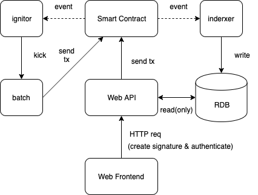
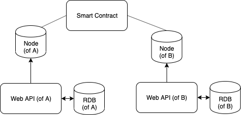

---

# 現実的なアーキテクチャと技術選択
* どこまで疎結合にするか
   * コンポーネントが多いと作るものが無駄に増える
* 何で作るか・何を使って作るか
   * Web API
   * Frontend
   * indexDB何にしよう？(RDB? KVS?)
   * indexer, ignitorどうしよう
   * ノードは何が良いだろう？コンセンサスアルゴリズムは？

--- 
# さしあたってWeb APIはGoで作ることに
## @とあるプロジェクト

---
# GoでEthereumのコントラクトを叩く
* Contractのbindingsを生成する or RPCリクエストを頑張って作る
* gethのツールチェイン `abigen`

```
truffle compile # truffleのアーティファクト生成
# jqでアーティファクトからabiだけ抽出
for json in `ls contracts/build/contracts/*.json`; do cat $json | jq .abi > $json.abi; done;
```
abiからbindingsを生成
```
abigen --abi /home/contracts/build/contracts/TxRelay.json.abi --pkg contract --type TxRelay --out /home/tx_relay.go mv tx_relay.go api/contracts/
```

適切にMakefileを書いて効率化します
```
make extract_abi
make abigen_all
```

---
# 生成されるbindings(読み出し/tx実行)

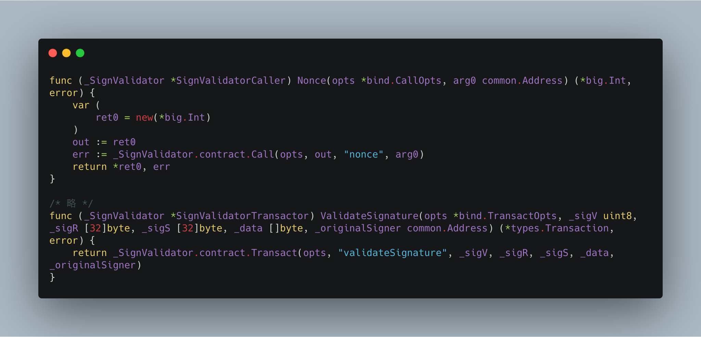

---
# 生成されるbindings(イベント監視)
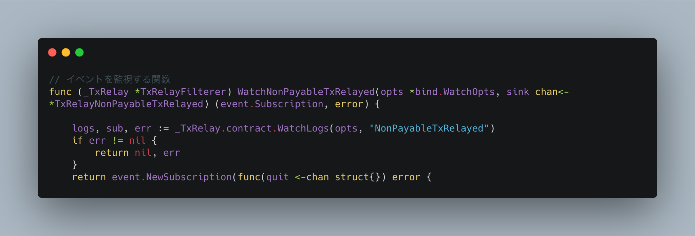

---
# いけそうに見えるが...
* buildパイプラインが若干長い
    * contract変更 -> compile -> abigen -> go build 
* ライブラリとしてのgethは小回りが効かない
    * estimateGasとかですら結構やるの大変
* バイト列の扱いが各所で異なり辛い
    * "0x1234...." @ Frontend, JavaScript
    * [0x11, 0xab,...] @ Web API, Go[32]byte (prefixの0xは不要)
    * "0x1234...." @ Contract, Solidity
    * Front -> web api -> contractでやり取りする度に変換が必要（つらすぎる）
* 何かやろうとするとgethを読まないといけない
    * 簡単なドキュメント：[Ethereum Development with Go
](https://goethereumbook.org/en/)
   
---

# みなさんweb3.js使ってますか？
# みなさんweb3.jsでハマったことないですか？

--- 

# web3.jsのつらみ
* カジュアルに破壊される後方互換性
   * かゆい所に手が届かないドキュメント (&  突然の404)
* 普通にバグってて動かない(1.0.34 - 1.0.37くらい)
    * イベントのsubscribe周り
    * コントラクトデプロイ -> イベントが履かれているの確認 -> web3.js側が無反応 -> 原因探る -> 無限に時間が溶ける
* TypeScriptと相性が悪い...(型定義が微妙...)
* 他にもいろいろ...

---

# web3.jsを捨てて😢ethers.jsを使うことに😍

---
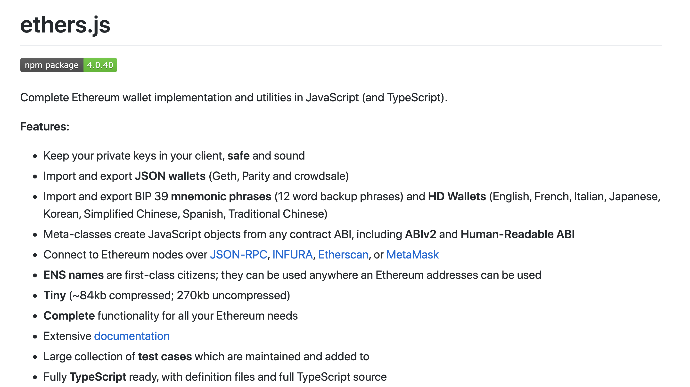

---


--- 

# ethers.jsの良いところ
* そもそもTypeScriptで開発されている&型定義がイケているの
* かゆい所に手が届くドキュメント
* やりたいことが自然にできる
   * eventを取ってきてRLP decodeしたい
   * データをsolidityの`keccak`と同じ方式でハッシュ化して署名したい
   * コントラクトの関数を動的に呼び替えたい
       * `eth.send(HogeContractFunction.Create, ...hoge.toArgs())`

---
## ethers.jsを使う前提でWeb APIもGo -> TypeScriptへ
* Ethereumは全体的にjsのライブラリが整っているので、NodeJSを使うのは悪い選択肢ではなさそう
   * Goさん頑張って欲しい
   * _Rustツカイタイナ〜_

## 色々なプロジェクトで採用しているstack
* WebAPI ... TypeScript(express) + TypeORM + ethers.js
* Frontend ... Nuxt.js
* Tools ... dbmate (migration), Ganache CLI, Truffle

---

## ethers.jsを使い倒すためのツール: buidler.dev
* `@nomiclabs/buidler`
* consoleからもdeployスクリプトからもethersを使いたい〜
* ethers.jsが使えてTypeScriptフレンドリーなタスクランナー(Yet Another Truffle)
* コントラクトのエラーの詳細なstack trace出力
* configがTruffleに比べると柔軟
* `yarn add --dev @nomiclabs/buidler`
    * global installだとTypeScirptでconfigが書けない

---

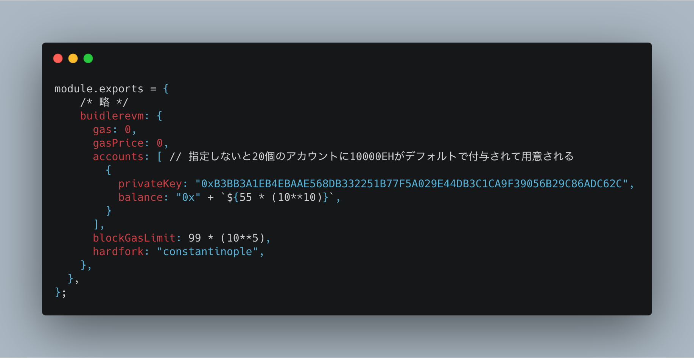

---

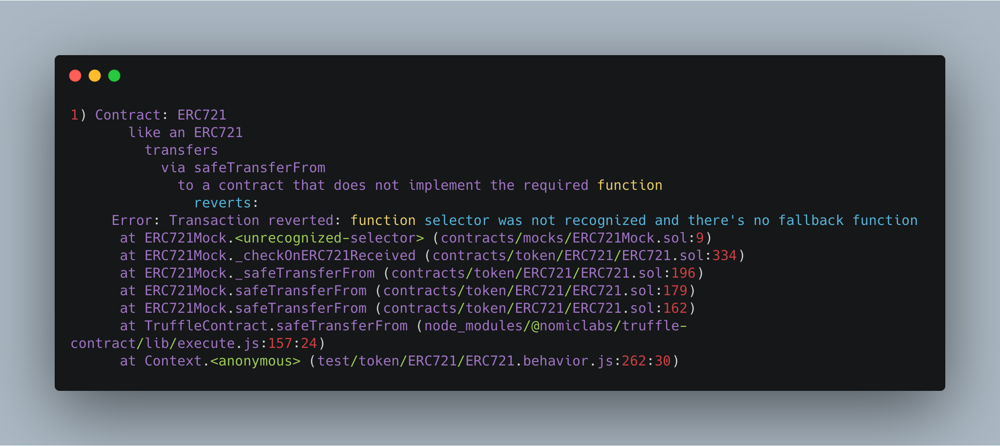
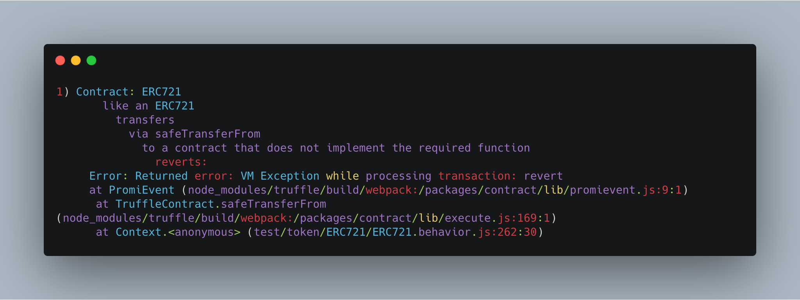

---
## その他機能もいろいろ
* pulginでよしなに拡張できる
* builder consoleからethers.jsでノードとインタラクション

--- 

# その他便利ツール
* indexer
    * Consensysの出してるやつ...
    * Eventeum (by Consensys)
    * the Graph
    * Eth.events
    * https://scrapbox.io/layerx/Ethereum_Indexer比較 に詳しい
* BaaS
    * Kaleidoの出来がくっそ良い
        * Zether(秘匿送金)
        * Block explorer
* static analysis tools
    * MythX
    * etc...
---

# 骨の折れる（楽しい）実装たち👻

---

# 署名検証を用いた認証
* 基本の流れ
    * サーバorコントラクトからメッセージを送る
    * メッセージを含んだハッシュ値に秘密鍵で署名
        * EIP191
        * EIP1271
    * サーバorコントラクトで検証(= ecrecover)
    * 実装前のお気持ち：「こんなん一瞬やろ」
    * 実際：結構大変
        * 少しでも入力が異なるとハッシュが変わる
        * Solidityのkeccakに対応するクライアント側の関数isどれ...??
        * `abi.encodePacked`なにやってるの ...
        * 型の指定が雑だとRLPエンコードの違いでハッシュが変わる
---
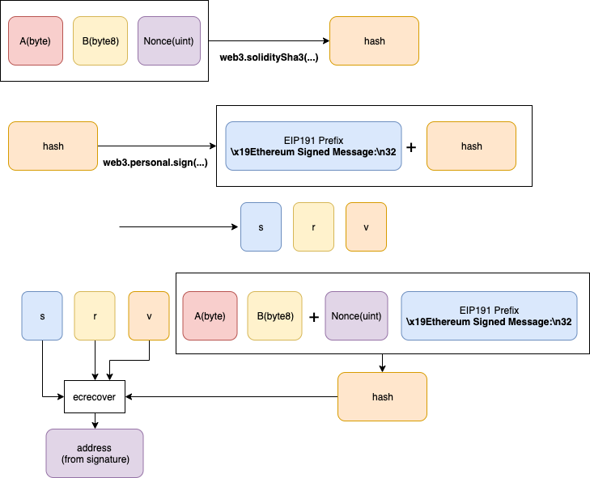

---

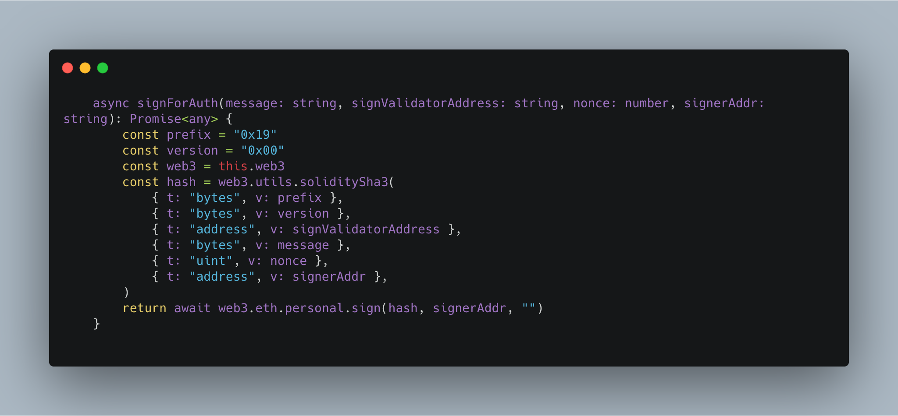

---
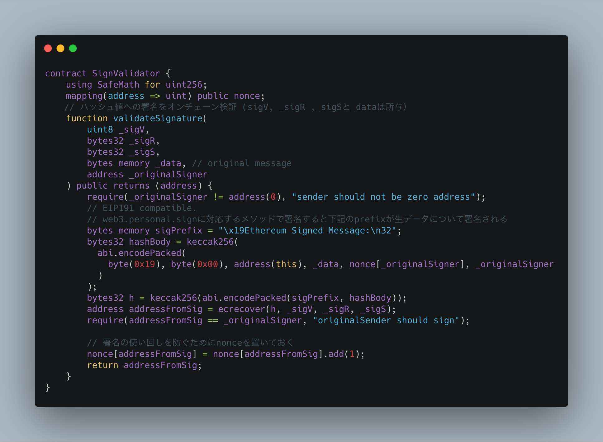

---
## 参考
* MetaMaskからsignするときは`web3.personal.sign`でないと処理が止まります（安全性の観点から、任意のメッセージに署名できる`web3.eth.sign`に非対応）
* 署名検証 -> WebAPIへのアクセストークン発給とかやることが多そう
* コントラクトエンドで検証するにしろ、サーバサイドでやるにしろ `nonce`は必須
* `web3.soliditySha3`は型が指定できるので安心（型が違うとRLPエンコードが変わって死にます..）
* `ethers.js`の場合
```
let sig = ethers.utils.splitSignature(flatSig);
let recovered = await contract.verifyHash(messageHash, sig.v, sig.r, sig.s);
utils.solidityKeccak256(types,values)
utils.soliditySha256(types,values)
utils.solidityPack(types,values)
```

---
# メタトランザクション(#とは)
* Gas代を誰かに代りに払ってもらう
* 仕様は色々提案されている
   * ERC1776([m0t0k1ch1さんのブログ](https://m0t0k1ch1st0ry.com/blog/2019/03/09/meta-tx/)が詳しい)
   * [uPortのやつ](https://medium.com/uport/making-uport-smart-contracts-smarter-part-3-fixing-user-experience-with-meta-transactions-105209ed43e0)
   * ERC865(ERC20でガスを払う)
   * ERC1077
* とあるプロジェクトでやりたかったこと
    * モノを売り買いさせる（ETH払い）
    * ガスはエンドユーザに払わせない
    * 署名だけをクライアントで行わせる
* できることを勘違いしたこともあり辛かった...

---
## 実装を始めたくらいのイメージ
1. txの雛形を作る=関数, 引数をRLPエンコードする
2. クライアントで署名（！？）
3. 一旦サーバ(Web API)に投げる
4. サーバ側でネットワークにブロードキャスト（署名する！？ & GASを払う）
* 基本的には署名した人（アドレス）に該当するアカウントからガスが引かれるのでこの仕組は無理...
* = `msg.sender` に該当する人がかならずガスを払う

#### 最終的な実装
1. クライアント側で実行したい関数と引数を指定アクセストークンと一緒にサーバへ投げつける
2. サーバ側は誰が実行元(originalな署名者)かを明記して`tx`を作ってネットワークに送信、コントラクトでexternal callでtx実行

---
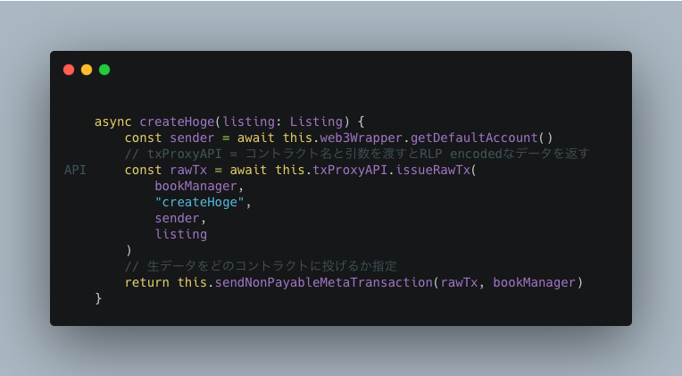

---

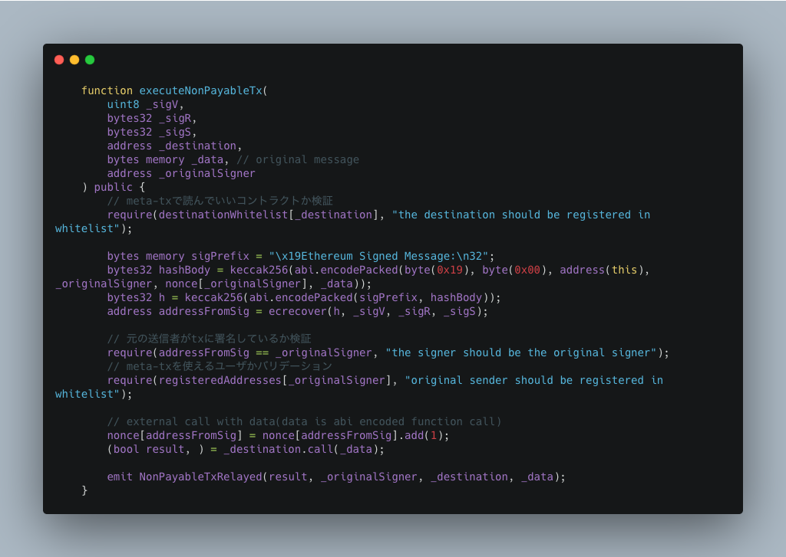

---
## 勘のいいみなさまはお気づきでしょう

---
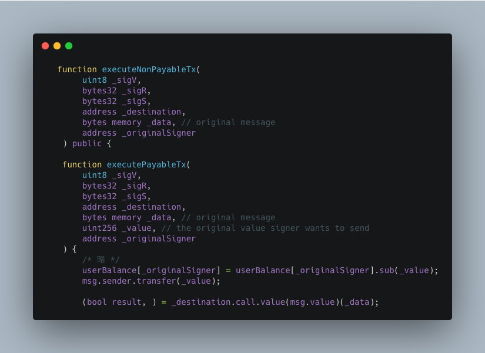

--- 
## 閑話休題

---


---

# 罠・そして罠

---

## 事件簿
* Truffleバグってる事件
* ブロックチェーン調子悪い事件
    * 何故か開発ノードが動かなくなる
* Ganacheのautomineの罠
    * 偶然動いてた事件
* 環境変数複雑過ぎ問題
    * サーバとかノードとか多すぎ...
* EVM殿...
    * stack too deep
    * コントラクトサイズが上限超えてデプロイ不能にに
    * mappingはkeys取れない問題 
* Solidityむずい
    * transferFromむずい