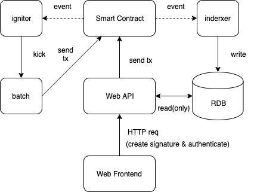
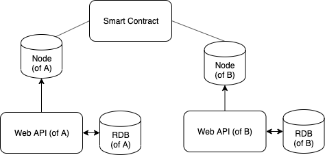
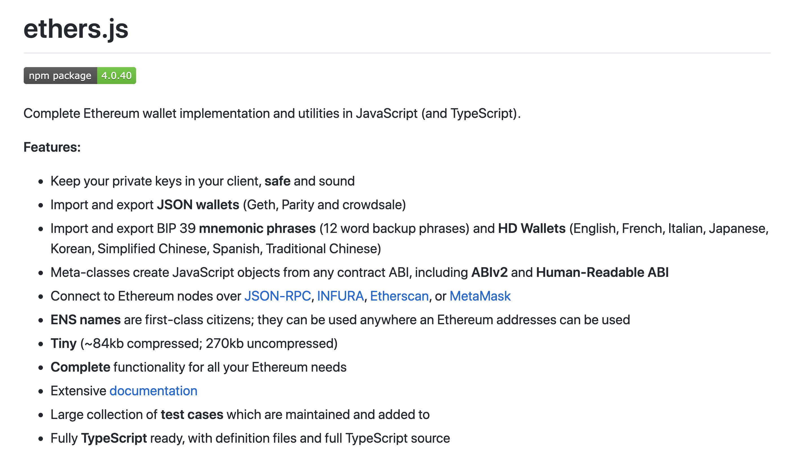
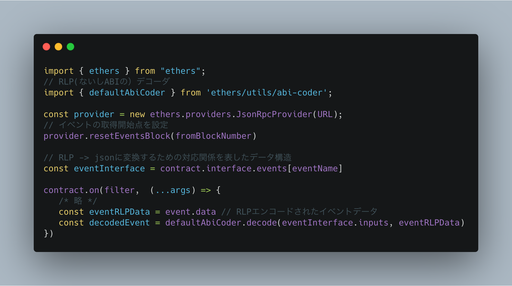

# 実践:Ethereumを利用ã—ãŸã‚¢ãƒ—リケーション開発
## 技術é¸æŠãƒ»ã‚¢ãƒ¼ã‚­ãƒ†ã‚¯ãƒãƒ£ãƒ»åœ°é›·

Masashi Salvador Mitsuzawa, Lead Engineer @ LayerX

--- 

## 自己紹介

### Masashi Salvador Mitsuzawa (@masashisalvador)
* Lead Engineer @ LayerX
* 好ããªè¨€èª:Go, JavaScript, Haskell, Kotlin
* 軸足ã¯ãƒãƒƒã‚¯ã‚¨ãƒ³ãƒ‰ã‚¨ãƒ³ã‚¸ãƒ‹ã‚¢
* 趣味：山・茶é“・計算論的ç¥çµŒç§‘å­¦ etc

---

# 話ã™ã“ã¨
* ç¾å®Ÿçš„ãªã‚¢ãƒ¼ã‚­ãƒ†ã‚¯ãƒãƒ£
    * Web API, indexDB, indexer(ignitor)
* 言èªé¸æŠãƒ»å®Ÿè£…・便利ツールãƒã‚§ã‚¤ãƒ³
    * Go?
    * ã•ã‚ˆãªã‚‰web3.js....
    * 様々ãªä¾¿åˆ©ãƒ„ールãŸã¡
* 骨ã®æŠ˜ã‚Œã‚‹å®Ÿè£…
    * ç½²å検証＠コントラクト
    * メタトランザクション（的ãªã‚‚ã®ï¼‰
    * etc...
* スãƒãƒ¼ãƒˆã‚³ãƒ³ãƒˆãƒ©ã‚¯ãƒˆé–‹ç™ºç‰¹æœ‰ã®åœ°é›·ã¨å¯¾å¿œç­–

---

# ç¾å®Ÿçš„ãªã‚¢ãƒ¼ã‚­ãƒ†ã‚¯ãƒãƒ£ã®ãŸã‚ã«è€ƒãˆã‚‹ã¹ãã“ã¨
* エンドユーザãŒWalletã‚’æŒã£ã¦ã„る仮定ã—ãªã„
  * サーãƒã‚µã‚¤ãƒ‰ã§éµã‚’æŒã¤
  * éµã‚’使ã£ãŸèªè¨¼æ©Ÿæ§‹
* Ethereumã®ã‚³ãƒ³ãƒˆãƒ©ã‚¯ãƒˆã¯Readã®æ©Ÿèƒ½ãŒè²§å¼±
  * 基本 key-valueçš„ã«ã—ã‹å¼•ã‘ãªã„
  * 一覧å–得・検索・ページングetc
  * コントラクトをãƒã‚¹ã‚¿ãƒ¼ã¨ã—ã¦åˆ¥DBã«index
* 自動執行（？）ï¼ã‚¤ãƒ™ãƒ³ãƒˆé§†å‹•
  * イベントã¯åã‘ã‚‹ãŒãƒãƒƒãƒçš„ãªæ©Ÿèƒ½ã¯ã‚³ãƒ³ãƒˆãƒ©ã‚¯ãƒˆã«ã¯ãªã„
  * イベントを見る -> 処ç†ã‚’kick

---



---

# ç¾å®Ÿçš„ãªã‚¢ãƒ¼ã‚­ãƒ†ã‚¯ãƒãƒ£ã¨æŠ€è¡“é¸æŠ
* ã©ã“ã¾ã§ç–çµåˆã«ã™ã‚‹ã‹
   * コンãƒãƒ¼ãƒãƒ³ãƒˆãŒå¤šã„ã¨ä½œã‚‹ã‚‚ã®ãŒç„¡é§„ã«å¢—ãˆã‚‹
* 何ã§ä½œã‚‹ã‹ãƒ»ä½•ã‚’使ã£ã¦ä½œã‚‹ã‹
   * Web API
   * Frontend
   * indexDB何ã«ã—よã†ï¼Ÿ(RDB? KVS?)
   * indexer, ignitorã©ã†ã—よã†
   * ãƒãƒ¼ãƒ‰ã¯ä½•ãŒè‰¯ã„ã ã‚ã†ï¼Ÿã‚³ãƒ³ã‚»ãƒ³ã‚µã‚¹ã‚¢ãƒ«ã‚´ãƒªã‚ºãƒ ã¯ï¼Ÿ

--- 
# ã•ã—ã‚ãŸã£ã¦Web APIã¯Goã§ä½œã‚‹ã“ã¨ã«
## @ã¨ã‚るプロジェクト

---
# Goã§Ethereumã®ã‚³ãƒ³ãƒˆãƒ©ã‚¯ãƒˆã‚’å©ã
* Contractã®bindingsを生æˆã™ã‚‹ or RPCリクエストを頑張ã£ã¦ä½œã‚‹
* gethã®ãƒ„ールãƒã‚§ã‚¤ãƒ³ `abigen`

```
truffle compile # truffleã®ã‚¢ãƒ¼ãƒ†ã‚£ãƒ•ã‚¡ã‚¯ãƒˆç”Ÿæˆ
# jqã§ã‚¢ãƒ¼ãƒ†ã‚£ãƒ•ã‚¡ã‚¯ãƒˆã‹ã‚‰abiã ã‘抽出
for json in `ls contracts/build/contracts/*.json`; do cat $json | jq .abi > $json.abi; done;
```
abiã‹ã‚‰bindingsを生æˆ
```
abigen --abi /home/contracts/build/contracts/TxRelay.json.abi --pkg contract --type TxRelay --out /home/tx_relay.go mv tx_relay.go api/contracts/
```

é©åˆ‡ã«Makefileを書ã„ã¦åŠ¹ç‡åŒ–ã—ã¾ã™
```
make extract_abi
make abigen_all
```

---
# 生æˆã•ã‚Œã‚‹bindings(読ã¿å‡ºã—/tx実行)


---
# 生æˆã•ã‚Œã‚‹bindings(イベント監視)


---
# ã„ã‘ãã†ã«è¦‹ãˆã‚‹ãŒ...
* buildパイプラインãŒè‹¥å¹²é•·ã„
    * contract変更 -> compile -> abigen -> go build 
* ライブラリã¨ã—ã¦ã®gethã¯å°å›ã‚ŠãŒåŠ¹ã‹ãªã„
    * estimateGasã¨ã‹ã§ã™ã‚‰çµæ§‹ã‚„ã‚‹ã®å¤§å¤‰
* ãƒã‚¤ãƒˆåˆ—ã®æ‰±ã„ãŒå„所ã§ç•°ãªã‚Šè¾›ã„
    * "0x1234...." @ Frontend, JavaScript
    * [0x11, 0xab,...] @ Web API, Go[32]byte (prefixã®0xã¯ä¸è¦)
    * "0x1234...." @ Contract, Solidity
    * Front -> web api -> contractã§ã‚„ã‚Šå–ã‚Šã™ã‚‹åº¦ã«å¤‰æ›ãŒå¿…è¦ï¼ˆã¤ã‚‰ã™ãる）
* 何ã‹ã‚„ã‚ã†ã¨ã™ã‚‹ã¨gethを読ã¾ãªã„ã¨ã„ã‘ãªã„
    * ç°¡å˜ãªãƒ‰ã‚­ãƒ¥ãƒ¡ãƒ³ãƒˆï¼š[Ethereum Development with Go
](https://goethereumbook.org/en/)
   
---

# ã¿ãªã•ã‚“web3.js使ã£ã¦ã¾ã™ã‹ï¼Ÿ
# ã¿ãªã•ã‚“web3.jsã§ãƒãƒã£ãŸã“ã¨ãªã„ã§ã™ã‹ï¼Ÿ

--- 

# web3.jsã®ã¤ã‚‰ã¿
* カジュアルã«ç ´å£Šã•ã‚Œã‚‹å¾Œæ–¹äº’æ›æ€§
   * ã‹ã‚†ã„所ã«æ‰‹ãŒå±Šã‹ãªã„ドキュメント (&  çªç„¶ã®404)
* 普通ã«ãƒã‚°ã£ã¦ã¦å‹•ã‹ãªã„(1.0.34 - 1.0.37ãらã„)
    * イベントã®subscribe周り
    * コントラクトデプロイ -> イベントãŒå±¥ã‹ã‚Œã¦ã„ã‚‹ã®ç¢ºèª -> web3.jså´ãŒç„¡åå¿œ -> åŸå› æ¢ã‚‹ -> ç„¡é™ã«æ™‚é–“ãŒæº¶ã‘ã‚‹
* TypeScriptã¨ç›¸æ€§ãŒæ‚ªã„...(å‹å®šç¾©ãŒå¾®å¦™...)
* ä»–ã«ã‚‚ã„ã‚ã„ã‚...

---

# web3.jsã‚’æ¨ã¦ã¦ğŸ˜¢ethers.jsを使ã†ã“ã¨ã«ğŸ˜

---


---



--- 

# ethers.jsã®è‰¯ã„ã¨ã“ã‚
* ãã‚‚ãã‚‚TypeScriptã§é–‹ç™ºã•ã‚Œã¦ã„ã‚‹&å‹å®šç¾©ãŒã‚¤ã‚±ã¦ã„ã‚‹ã®
* ã‹ã‚†ã„所ã«æ‰‹ãŒå±Šãドキュメント
* ã‚„ã‚ŠãŸã„ã“ã¨ãŒè‡ªç„¶ã«ã§ãã‚‹
   * eventã‚’å–ã£ã¦ãã¦RLP decodeã—ãŸã„
   * データをsolidityã®`keccak`ã¨åŒã˜æ–¹å¼ã§ãƒãƒƒã‚·ãƒ¥åŒ–ã—ã¦ç½²åã—ãŸã„
   * コントラクトã®é–¢æ•°ã‚’å‹•çš„ã«å‘¼ã³æ›¿ãˆãŸã„
       * `eth.send(HogeContractFunction.Create, ...hoge.toArgs())`

---
## ethers.jsを使ã†å‰æã§Web APIã‚‚Go -> TypeScriptã¸
* Ethereumã¯å…¨ä½“çš„ã«jsã®ãƒ©ã‚¤ãƒ–ラリãŒæ•´ã£ã¦ã„ã‚‹ã®ã§ã€NodeJSを使ã†ã®ã¯æ‚ªã„é¸æŠè‚¢ã§ã¯ãªã•ãã†
   * Goã•ã‚“é ‘å¼µã£ã¦æ¬²ã—ã„
   * _Rustツカイタイナ〜_

## 色々ãªãƒ—ロジェクトã§æ¡ç”¨ã—ã¦ã„ã‚‹stack
* WebAPI ... TypeScript(express) + TypeORM + ethers.js
* Frontend ... Nuxt.js
* Tools ... dbmate (migration), Ganache CLI, Truffle

---

## ethers.jsを使ã„倒ã™ãŸã‚ã®ãƒ„ール: buidler.dev
* `@nomiclabs/buidler`
* consoleã‹ã‚‰ã‚‚deployスクリプトã‹ã‚‰ã‚‚ethersを使ã„ãŸã„〜
* ethers.jsãŒä½¿ãˆã¦TypeScriptフレンドリーãªã‚¿ã‚¹ã‚¯ãƒ©ãƒ³ãƒŠãƒ¼(Yet Another Truffle)
* コントラクトã®ã‚¨ãƒ©ãƒ¼ã®è©³ç´°ãªstack trace出力
* configãŒTruffleã«æ¯”ã¹ã‚‹ã¨æŸ”軟
* `yarn add --dev @nomiclabs/buidler`
    * global installã ã¨TypeScirptã§configãŒæ›¸ã‘ãªã„

---


---


---
## ãã®ä»–機能もã„ã‚ã„ã‚
* pulginã§ã‚ˆã—ãªã«æ‹¡å¼µã§ãã‚‹
* builder consoleã‹ã‚‰ethers.jsã§ãƒãƒ¼ãƒ‰ã¨ã‚¤ãƒ³ã‚¿ãƒ©ã‚¯ã‚·ãƒ§ãƒ³

--- 

# ãã®ä»–便利ツール
* indexer
    * Consensysã®å‡ºã—ã¦ã‚‹ã‚„ã¤...
    * Eventeum (by Consensys)
    * the Graph
    * Eth.events
    * https://scrapbox.io/layerx/Ethereum_Indexer比較 ã«è©³ã—ã„
* BaaS
    * Kaleidoã®å‡ºæ¥ãŒãã£ã良ã„
        * Zether(秘匿é€é‡‘)
        * Block explorer
* static analysis tools
    * MythX
    * etc...
---

# 骨ã®æŠ˜ã‚Œã‚‹ï¼ˆæ¥½ã—ã„）実装ãŸã¡ğŸ‘»

---

# ç½²å検証を用ã„ãŸèªè¨¼
* 基本ã®æµã‚Œ
    * サーãƒorコントラクトã‹ã‚‰ãƒ¡ãƒƒã‚»ãƒ¼ã‚¸ã‚’é€ã‚‹
    * メッセージをå«ã‚“ã ãƒãƒƒã‚·ãƒ¥å€¤ã«ç§˜å¯†éµã§ç½²å
        * EIP191
        * EIP1271
    * サーãƒorコントラクトã§æ¤œè¨¼
        * 検証= ecrecover
    * 実装å‰ã®ãŠæ°—æŒã¡ï¼šã€Œã“ã‚“ãªã‚“一ç¬ã‚„ã‚ã€
    * 実際：çµæ§‹å¤§å¤‰
        * å°‘ã—ã§ã‚‚入力ãŒç•°ãªã‚‹ã¨ãƒãƒƒã‚·ãƒ¥ãŒå¤‰ã‚ã‚‹
        * Solidityã®keccakã«å¯¾å¿œã™ã‚‹ã‚¯ãƒ©ã‚¤ã‚¢ãƒ³ãƒˆå´ã®é–¢æ•°isã©ã‚Œ...??
        * `abi.encodePacked`ãªã«ã‚„ã£ã¦ã‚‹ã® ...
        * å‹ã®æŒ‡å®šãŒé›‘ã ã¨RLPエンコードã®é•ã„ã§ãƒãƒƒã‚·ãƒ¥ãŒå¤‰ã‚ã‚‹

    ---
    


